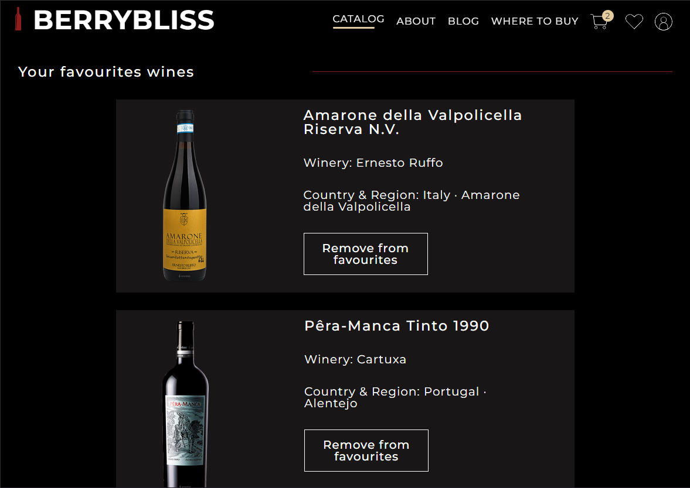

# BERRYBLISS WEBSITE 


## Live Demo
Check out the live website: [BERRYBLISS WEBSITE](https://berrybliss.netlify.app/)

## Description
Welcome to my project! This is a BERRYBLISS WEBSITE made in React.js and React Router DOM library with Vite server. Vite.js supports JSX and helps to check and make changes to the code and see the results in the browser without waiting for a full build process.
API data, React hooks and components, responsive web design, and Google Maps were used for building. This project is an online store template that allows users to see the catalog and add items to the saved items or shopping cart. Users can check or link to the address on the maps and create a private profile. It also allows the website to be used on phones or tablets, with a responsive menu.

### Key features of this website include:

- **React.js and React Router DOM**: Utilizing React.js and React Router DOM library for building the website.
- **Vite Server**: Employing Vite server for fast development and hot module replacement.
- **API Data Integration**: Integrating API data into the website. 


- **React Hooks and Components**: Utilizing React hooks and components for efficient state management and modular design.


    
   


- **Responsive Web Design**: Implementing responsive web design principles to ensure optimal viewing experience across different devices. Responsive Menu: Implementing a responsive menu for seamless navigation on phones and tablets.


- **Google Maps Integration**: Integrating Google Maps for address verification and location linking. 


- **Online Store Template**: Providing an online store template with catalog browsing, item addition to cart, and saved items functionality.
- **User Profiles**: Allowing users to create private profiles for personalized experience.


## Development

Alternatively, instead of using the hosted version of the project, BERRYBLISS WEBSITE can be run locally for code generation purposes or contributions.

To be able to start development on Amplication, make sure that you have the following prerequisites installed:
- Node.js
- Git

## Instructions
To get started with the project, follow these steps:

1. **Download**: Download the code from the branch or clone the repository and install dependencies:
```shell
git clone https://github.com/ElenBlackwood/BerryBliss.git && cd ./BerryBliss && npm install
```
3. **Open**: Open the downloaded code in any code editor. 

4. **Terminal**: Open the terminal.

5. **Navigate**:  Navigate to the main folder in the terminal. Make sure you are in the right folder:

```shell
cd ./BerryBliss
```

6. **Start**: Start the project with the following command:
 
```shell
npm run dev
```
This will start the project and you can view it in your browser.

## Contributing
BERRYBLIS WEBSITE is an open-source project. 
If you would like to contribute to this project, feel free to fork the repository and submit a pull request. 

## License
Distributed under the MIT License. See LICENSE.txt for more information.
